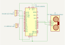
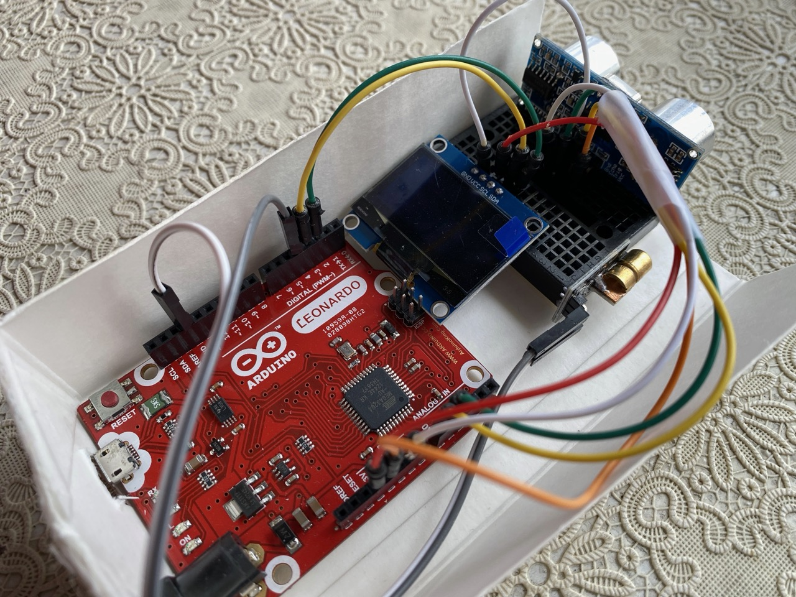

# Ultrasonic Rangefinder 

## 電子元件（Component）

使用 Arduino Leonardo 為主體，接上超音波測距模組（HC-SR04）、OLED 顯示模組（SH1106）以及雷射模組（KY-008）。

開始時 Arduino 只有安裝 HC-SR04，將 Arduino 接上電腦 USB 啟動後，經由 USB serial 傳送數據在電腦上顯示，所以 Arduino 要一直和電腦連接著，測距儀無法四處移動。接著嘗試藍牙無線傳輸方案，數據成功經由藍牙模組傳輸到電腦上，如此一來測距儀就不用連接電腦，可以自由移動了，不過檢視數據還是得回到電腦前，這個方案實用性太低。

後來加買 SH1106 顯示模組，直接將測距數據顯示在 SH1106 上，就能拿著測距儀到處進行測量了。再來加了 KY-008 雷射模組，能夠明顯看到測距儀所面對的方向，向旁人演示功能時，更容易說明當前測距的標的物。

## 線路連接圖

首次嘗試使用 [KiCad](https://www.kicad.org/) 畫了電路連接圖，因不熟悉 KiCad 操作，找不到 SH1106 和 KY-008 的元件圖，所以拿通用圖型替代，另外在表格中說明 SH1106 和 KY-008 針腳用途。

| Pin # | SS1106 | KY-008 |
| ----- | ------ | ------ |
| 1     | GND    | Signal |
| 2     | VCC    |        |
| 3     | SCL    | GND    |
| 4     | SDA    |        |

## 成品演示

把所有電子元件黏貼在紙盒上，就成了下面這幅模樣。

演示影片：https://youtube.com/shorts/f0__IDJjBbg?feature=share

## 主要程式邏輯

以下針對比較複雜的執行邏輯進行說明

### loop()

在 Arduino loop() 每一輪執行的主要任務為

1. 點亮雷射光。
2. 發射超音波，讀取超音波反射回模組所經過的時間。
3. 由時間計算出超音波模組與標的物的距離。
4. 顯示測量距離。
5. 關閉雷射光。
6. 等待 calculateDelay() 計算出來的時間

### calculateDelay()

計算每一輪 loop() 執行的間隔時間。輸入參數為距離值，回傳延遲時間。延遲時間與距離使用指數曲線進行縮放，使其成為非線性關係。在較大距離時，距離的變化對延遲時間的影響會比在較小距離時更顯著。
