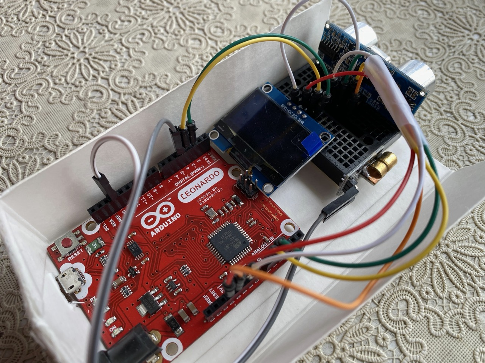

# Ultrasonic Rangefinder

（This content was translated from README.md using the Claude 3.5 Sonnet AI model）

## Component

Using Arduino Leonardo as the main controller, connected with an ultrasonic distance module (HC-SR04), OLED display module (SH1106), and laser module (KY-008).

Initially, the Arduino was only equipped with HC-SR04. After connecting the Arduino to the computer via USB, data was transmitted through USB serial and displayed on the computer, so the Arduino had to remain connected to the computer, limiting the rangefinder's mobility. Next, I tried a Bluetooth wireless transmission solution. The data was successfully transmitted to the computer via the Bluetooth module, allowing the rangefinder to move freely without computer connection. However, checking the data still required returning to the computer, making this solution impractical.

Later, I added the SH1106 display module to directly show the distance data on the SH1106, enabling portable measurements anywhere. Then I added the KY-008 laser module, which clearly shows the direction the rangefinder is facing, making it easier to demonstrate the functionality and explain the current measurement target to others.

## Circuit Connection Diagram

This was my first attempt at drawing a circuit diagram using [KiCad](https://www.kicad.org/). Due to unfamiliarity with KiCad operations, I couldn't find the component symbols for SH1106 and KY-008, so I used generic symbols instead. The pin functions for SH1106 and KY-008 are explained in the table below.

| Pin # | SS1106 | KY-008 |
| ----- | ------ | ------ |
| 1     | GND    | Signal |
| 2     | VCC    |        |
| 3     | SCL    | GND    |
| 4     | SDA    |        |

## Product Demonstration

All electronic components were attached to a cardboard box, resulting in the appearance shown below.

Demonstration video: https://youtube.com/shorts/f0__IDJjBbg?feature=share

## Main Program Logic

Below is an explanation of the more complex execution logic:

### loop()

The main tasks in each Arduino loop() execution are:

1. Turn on the laser light.
2. Emit ultrasonic waves and read the time taken for the waves to reflect back to the module.
3. Calculate the distance between the ultrasonic module and the target object based on the time.
4. Display the measured distance.
5. Turn off the laser light.
6. Wait for the time calculated by calculateDelay()

### calculateDelay()

Calculates the interval time between each loop() execution. Takes distance as input and returns delay time. The delay time is not directly proportional to the distance; instead, it's scaled using an exponential curve, making it non-linear. This means that changes in distance will have a more significant effect on the delay time at higher distances than at lower distances.