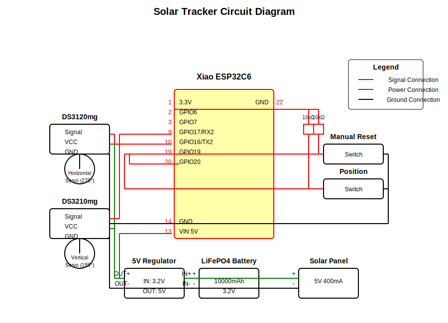
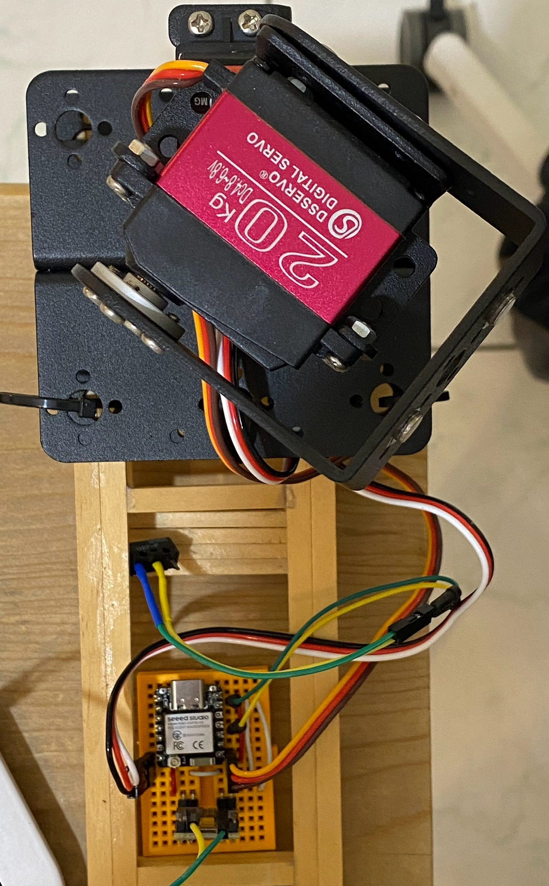

# Solar Tracker

(Translated from README.md by Claude 3.7 Sonnet)

Automatically adjusts the solar panel orientation using two servo motors based on solar position calculations to achieve optimal power generation efficiency. The system automatically tracks the sun's path from sunrise to sunset and pre-adjusts the solar panel to the next day's sunrise position during nighttime, maximizing energy collection.

## System Components

1. Xiao ESP32C6 development board
2. DS3120mg horizontal servo motor (angle range: 270 degrees)
3. DS3210mg vertical servo motor (angle range: 180 degrees)
4. 5V 400mA solar panel
5. 3-pin micro switches x 2 (for manual mode control)
6. LiFePO4 batteries (2x6000mAh, 3.2V) providing power input to 5V voltage regulator module

## Circuit Connection Diagram

(Generated by AI, Claude 3.7 sonnet)


*Circuit connection details:*

- Xiao ESP32C6 controls horizontal servo motor (DS3120mg) via GPIO16
- Xiao ESP32C6 controls vertical servo motor (DS3210mg) via GPIO17
- Manual reset switch connected to GPIO20
- Current position switch connected to GPIO19
- LiFePO4 battery (10000mAh, 3.2V) connected in parallel with solar panel (5V, 400mA)
- 5V voltage regulator module converts 3.2V input to 5V output, powering all components

## Working Principle

### Solar Position Calculation

This project uses formulas for calculating solar azimuth and elevation angles based on geographic location (latitude and longitude) and current time:

1. The system connects to the internet via WiFi and synchronizes time using an NTP server
2. The `SunPosition` class calculates the sun's azimuth and elevation angles based on current time and geographic location
3. The azimuth angle is converted to the horizontal servo motor angle, and the elevation angle is converted to the vertical servo motor angle

### Operation Modes

The system has three main operation modes:

1. **Daytime Tracking Mode**: Automatically activates when the sun's elevation angle is > 0 degrees, continuously tracking the sun's position
2. **Nighttime Preparation Mode**: Automatically calculates the next day's sunrise position after sunset and pre-adjusts the solar panel to that position
3. **Manual Reset Mode**: Triggered via the MANUAL_RESET_POS_PIN pin, resets the solar panel to a default position (horizontal 135 degrees, vertical 0 degrees)

### Servo Motor Control

The system controls servo motors through precise Pulse Width Modulation (PWM) signals:

- Horizontal servo motor: 0-270 degree range, corresponding to 500-2500 microsecond pulse width
- Vertical servo motor: 0-180 degree range, corresponding to 580-2480 microsecond pulse width
- To prevent motor overheating, the system employs a gradual movement strategy, limiting each maximum movement to 5 degrees

## Data Monitoring Setup

This system integrates VictoriaMetrics and Grafana to monitor and visualize the solar tracker's operational data:

1. VictoriaMetrics is used for time-series data storage, with the system sending metric data every 60 seconds
2. Tracked metrics include:
   - Solar azimuth and elevation angles
   - Servo motor horizontal and vertical positions
   - Nighttime mode status
3. Grafana dashboard presents the trends of these metrics

### Setup Steps

VictoriaMetrics: Download the executable from [GitHub](https://github.com/VictoriaMetrics/VictoriaMetrics/releases), extract and run the command `victoria-metrics-prod -retentionPeriod=100y` to start the service.

Grafana: Install using your operating system's package manager; or download from the [official website](https://grafana.com/grafana/download), extract and run `bin/grafana` to start the service.

## Installation and Configuration

### Hardware Installation

1. Connect the horizontal servo motor to the ESP32C6's GPIO16 pin
2. Connect the vertical servo motor to the ESP32C6's GPIO17 pin
3. Connect the manual reset switch to the GPIO20 pin
4. Connect the current position switch to the GPIO19 pin



### Software Configuration

1. Modify the WiFi credentials in the `config_secret.h` file:
```c
const char* ssid = "YOUR_WIFI_SSID";
const char* password = "YOUR_WIFI_PASSWORD";
```

2. Update the latitude and longitude according to your geographic location (default is Kaohsiung City):
```c
const double LATITUDE = 22.6273;
const double LONGITUDE = 120.3014;
```

3. To enable metrics collection, uncomment the following line:
```c
// #define ENABLE_METRIC_COLLECT
```

4. Modify the VictoriaMetrics settings to point to your server:
```c
const char* vmHost = "http://YOUR_VM_SERVER_IP:8428";
const char* deviceName = "YOUR_DEVICE_NAME";
```

## Calibration and Adjustment

Set the rotation range according to the specifications of the assembled servo motors.

```c++
// Servo motor range settings
const int HORIZONTAL_SERVO_MIN_ANGLE = 0;    // Horizontal servo motor max angle is 270 degrees
const int HORIZONTAL_SERVO_MAX_ANGLE = 270;  // Horizontal servo motor max angle is 270 degrees
const int VERTICAL_SERVO_MIN_ANGLE = 0;      // Vertical servo motor max angle is 180 degrees
const int VERTICAL_SERVO_MAX_ANGLE = 180;    // Vertical servo motor max angle is 180 degrees

```

My servo motor signal range has some slight deviations. Based on the observed rotation angles, the PWM range is set as follows:

```c++

// Servo motor pulse range (microseconds)
const int HORIZONTAL_SERVO_MIN_PULSE = 500;   // Corresponds to 0 degree position
const int HORIZONTAL_SERVO_MAX_PULSE = 2500;  // Corresponds to 270 degree position
const int VERTICAL_SERVO_MIN_PULSE = 580;     // Corresponds to 0 degree position
const int VERTICAL_SERVO_MAX_PULSE = 2480;    // Corresponds to 180 degree position
```

## Product Demonstration

Time-lapse of the solar tracker in actual operation: https://youtube.com/shorts/aTHwb26RYuk?si=8in0Wzu5c7Vx6CHZ

## System Limitations

- When the system starts, it requires a stable WiFi connection to obtain accurate time for calculating the sun's position
- Servo motors may need periodic calibration to maintain accuracy
- When the sun is directly overhead (elevation angle > 85 degrees), the horizontal servo motor will be fixed to point south (135 degrees) to avoid large-angle rotation of the horizontal motor.

## Implementation Experience

### Known Issues

- Theoretically, servo motors do not consume power when not rotating, but in practice, they sometimes consume nearly 100mA of power. Based on observation, this is likely because the actual angle hasn't reached the target angle, causing the motor to continuously attempt to rotate but unable to reach the target, resulting in high-frequency noise.
- As mentioned above, for light loads and small angle rotations, servo motors may continuously consume power, and the power obtained from solar energy is not sufficient to support servo motor operation for 24 hours.

### Future Improvement Directions

- Add a real-time clock module (RTC) to avoid relying on WiFi networks, enabling offline operation.
- Add power consumption monitoring functionality
  - When servo motors experience static power consumption, perform a large angle back-and-forth rotation to see if the issue can be resolved.
  - Cut off power when servo motors are stationary; restore power when rotation is needed.
