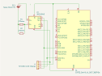
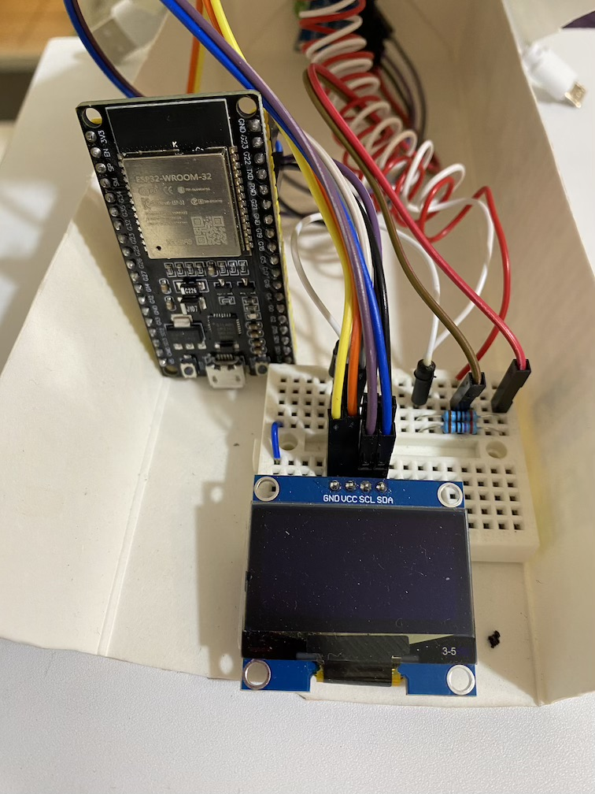
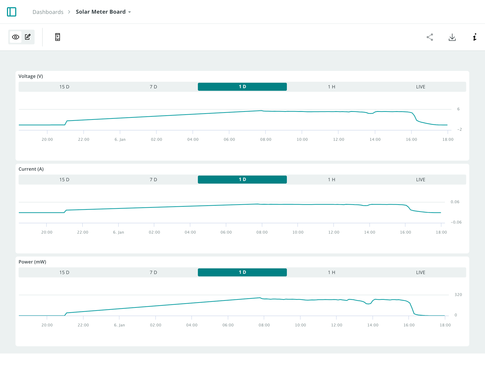

# Sunlight Meter V-1

Sunlight Meter 這系列專案主要用來體驗 [Arduino Cloud](https://cloud.arduino.cc/) 的各種功能。Arduino Cloud 提供數據收集、儀表板製作、遠端控制等功能，也具備線上整合開發工具（IDE）可以編寫程式，這種一站式環境能夠大幅降低開發 IoT 應用系統的門檻。身為一名熟悉 HTTP API 的軟體開發工程師，在工作上常用 InfluxDB 儲存數據，並以 Grafana 製作數據圖表，藉由實作這個系列的專案，實際嘗試 Arduino Cloud 功能帶來的便利性。

## 系統元件

1. ESP32 開發板：ESP-WROOM-32，38腳。
2. INA219 12bit 雙向電流電壓功率傳感器模組，I²C 介面。
3. SH1106 顯示模組，I²C 介面。
4. 270 歐姆電阻，數量為兩顆。
5. 太陽能板，規格為 5V 250mA。

## 電路連接圖

使用 INA219 模組來搜集太陽能板的電壓和電流數據，並聯兩顆 270 ohm 電阻作為負載。由於 INA219 以及 SH1106 皆使用 I²C 介面與 ESP32 開發板通訊，大幅簡化線路連接複雜度。

| Pin # | SH1106 |
| ----- | ------ |
| 1     | GND    |
| 2     | VCC    |
| 3     | SCL    |
| 4     | SDA    |

## Arduino Cloud 使用示範

本章僅說明概略步驟，實際操作時 Arduino Cloud 會有更詳細的提示。首先安裝 Arduino Cloud Agent，然後進行專案系統設定，步驟為

1. 新增裝置（Devices），在這個專案中就是 ESP32 開發板。
2. 新增物件（Things），可以是實體物件或者虛擬物件，在這個專案中是 Sunlight Meter 虛擬物件。
3. 於 Sunlight Meter 物件中新增變數（Variables），新增電壓、電流以及功率等變數，這些變數將由 INA219 提供數據。
4. 新增 Sketch，Sketch 將依據 Things 設定自動產生程式骨架。 

將 Sketch 程式碼貼上 AI 對話框，請 AI 加入 INA219、SH1106 模組相關程式後，複製 AI 輸出結果回 Sketch，即可編譯程式碼並上傳到 ESP32 開發板。

## 主要程式邏輯

### setup()

初始化 INA219 模組：因為專案使用的太陽能板僅 5V 250mA，所以設定 setCalibration_16V_400mA() 即可。

初始化 SH1106 模組：u8g2.begin()

初始化 Arduino Cloud SDK(?)：可於 thingProperties.h 查看初始化執行的動作。

### loop()

ArduinoCloud.update()，個人猜想應該是上傳和下載數據吧！

由 INA219 模組取得數據，設定到 thingProperties.h 所宣告的變數中，就會上傳到 Things Variables 裡面。

呼叫 displayMeasurements() 將數據顯示到 SH1106 模組上。

## 成品演示

組裝完成的電路如下圖

演示影片：https://youtube.com/shorts/8nRIJ7k6NEg?si=rgC_fTjrX-8QyhEt

## 數據與圖表

使用搜集到的數據製作儀表板（dashboard），呈現出以下三個折線圖。若要下載數據，可點擊儀表板右上角的下載按鈕（Download historic data），在此提供部份數據供參考：

1. [Sunlight Meter-Solar_Panel_Voltage.csv](Sunlight Meter-Solar_Panel_Voltage.csv)
2. [Sunlight Meter-Solar_Panel_Current.csv](Sunlight Meter-Solar_Panel_Current.csv)
3. [Sunlight Meter-Solar_Panel_Power.csv](Sunlight Meter-Solar_Panel_Power.csv)

## 實作心得

在這個專案系統開發上，體驗到 Arduino Cloud 優點

1. 毋需撰寫上傳數據的程式碼，全交由 ArduinoCloud 函式庫即可。
2. 提供行動裝置應用程式，可以在手機上觀看儀表板內容。
3. 提供 Sketch Secrets，用戶不需花費力氣在 secret 管理上；若改用 Arduino IDE，secret 管理就要自己設計。
4. Sketch 源始碼小幅度修改後，就可以拿到 Arduino IDE 中編譯。

感覺到的缺點則為

1. 相較於 Grafana，圖表（Chart）可以設定的屬性極少，較進階的數據視覺化無法呈現。
2. 數據記錄最小間隔為 10 秒