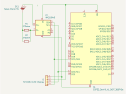
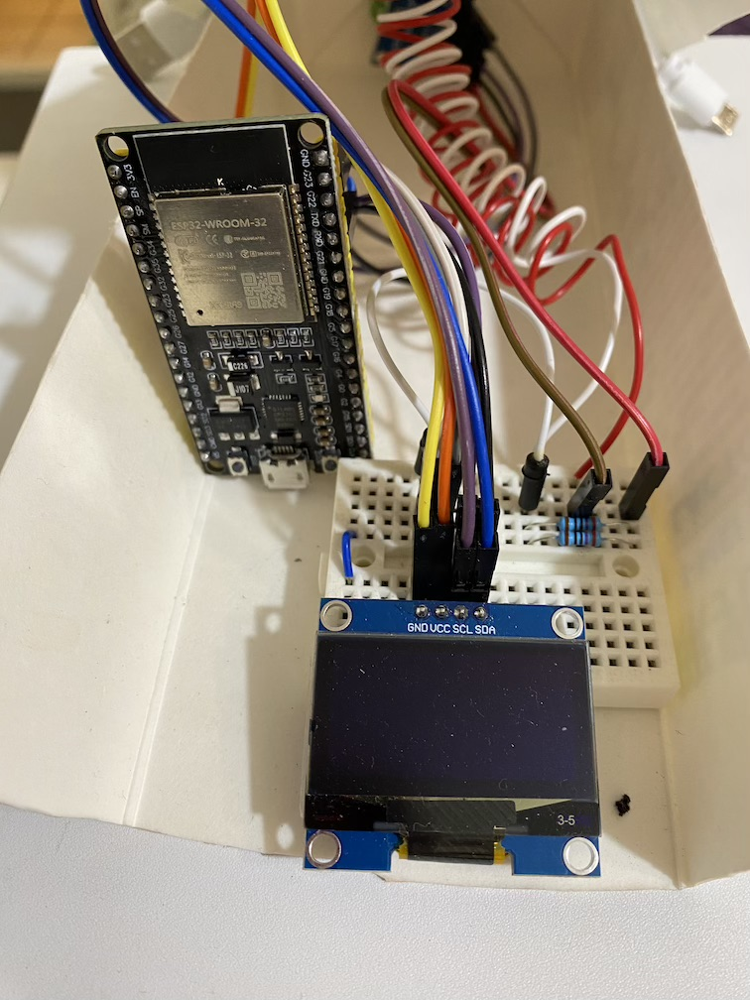
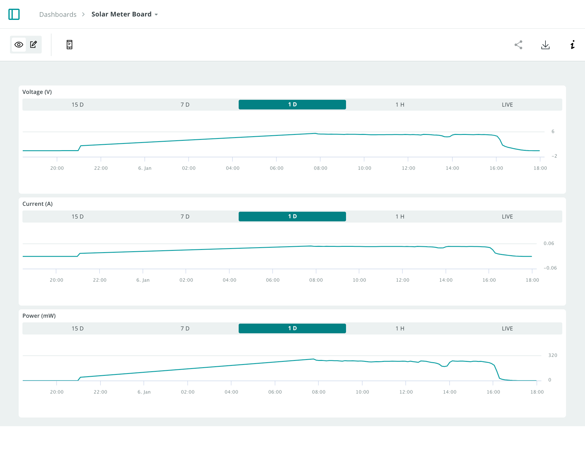

# Sunlight Meter V-1

（This content was translated from README.md using the Claude 3.5 Sonnet AI model）

The Sunlight Meter series of projects primarily aims to experience various features of [Arduino Cloud](https://cloud.arduino.cc/). Arduino Cloud provides data collection, dashboard creation, remote control, and other functionalities. It also includes an online integrated development environment (IDE) for programming. This all-in-one environment significantly reduces the barriers to developing IoT application systems. As a software engineer familiar with HTTP APIs, who frequently uses InfluxDB for data storage and Grafana for creating data visualizations at work, I implemented this series of projects to experience the convenience brought by Arduino Cloud features firsthand.

## System Components

1. ESP32 Development Board: ESP-WROOM-32, 38 pins.
2. INA219 12-bit bi-directional current/voltage/power sensor module with I²C interface.
3. SH1106 display module with I²C interface.
4. 270 ohm resistors, quantity: two.
5. Solar panel, specifications: 5V 250mA.

## Circuit Connection Diagram

The INA219 module is used to collect voltage and current data from the solar panel, with two 270 ohm resistors connected in parallel as the load. Since both the INA219 and SH1106 communicate with the ESP32 development board using the I²C interface, this greatly simplifies the circuit connection complexity.

| Pin # | SH1106 |
| ----- | ------ |
| 1     | GND    |
| 2     | VCC    |
| 3     | SCL    |
| 4     | SDA    |

## Arduino Cloud Usage Demonstration

This chapter only explains the general steps; Arduino Cloud will provide more detailed prompts during actual operation. First, install Arduino Cloud Agent, then proceed with the project system setup as follows:

1. Add Device - in this project, it's the ESP32 development board.
2. Add Thing - can be physical or virtual objects; in this project, it's the virtual Sunlight Meter object.
3. Add Variables to the Sunlight Meter object - add variables for voltage, current, and power, which will be provided by the INA219.
4. Create a new Sketch - the Sketch will automatically generate a program skeleton based on the Things settings.

Paste the Sketch code into the AI chat box, ask the AI to add INA219 and SH1106 module-related code, then copy the AI output back to the Sketch. You can then compile the code and upload it to the ESP32 development board.

## Main Program Logic

### setup()

Initialize INA219 module: Since the project uses a solar panel of only 5V 250mA, setting setCalibration_16V_400mA() is sufficient.

Initialize SH1106 module: u8g2.begin()

Initialize Arduino Cloud SDK(?): You can check the initialization actions in thingProperties.h.

### loop()

ArduinoCloud.update() - personally, I guess this is for uploading and downloading data!

Get data from the INA219 module and set it to the variables declared in thingProperties.h, which will then be uploaded to Things Variables.

Call displayMeasurements() to show the data on the SH1106 module.

## Final Product Demonstration

The assembled circuit is shown in the following image:

Demo video: https://youtube.com/shorts/8nRIJ7k6NEg?si=rgC_fTjrX-8QyhEt

## Data and Charts

Using the collected data, create a dashboard displaying the following three line charts. To download the data, click the download button (Download historic data) in the top right corner of the dashboard. Some sample data is provided for reference:

1. [Sunlight Meter-Solar_Panel_Voltage.csv](Sunlight Meter-Solar_Panel_Voltage.csv)
2. [Sunlight Meter-Solar_Panel_Current.csv](Sunlight Meter-Solar_Panel_Current.csv)
3. [Sunlight Meter-Solar_Panel_Power.csv](Sunlight Meter-Solar_Panel_Power.csv)

## Implementation Insights

During this project system development, I experienced the following advantages of Arduino Cloud:

1. No need to write code for data uploading; it's all handled by the ArduinoCloud library.
2. Provides a mobile application for viewing dashboard content on phones.
3. Provides Sketch Secrets, so users don't need to spend effort on secret management; with Arduino IDE, you would need to design secret management yourself.
4. The Sketch source code can be compiled in Arduino IDE with minimal modifications.

The disadvantages I noticed were:

1. Compared to Grafana, the Chart has very few configurable properties, making it impossible to present more advanced data visualizations.
2. The minimum interval for data logging is 10 seconds