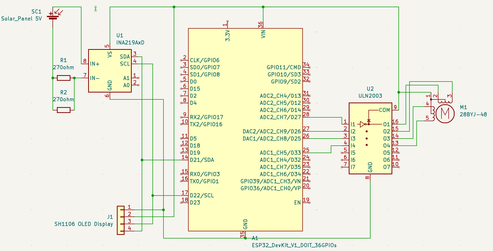
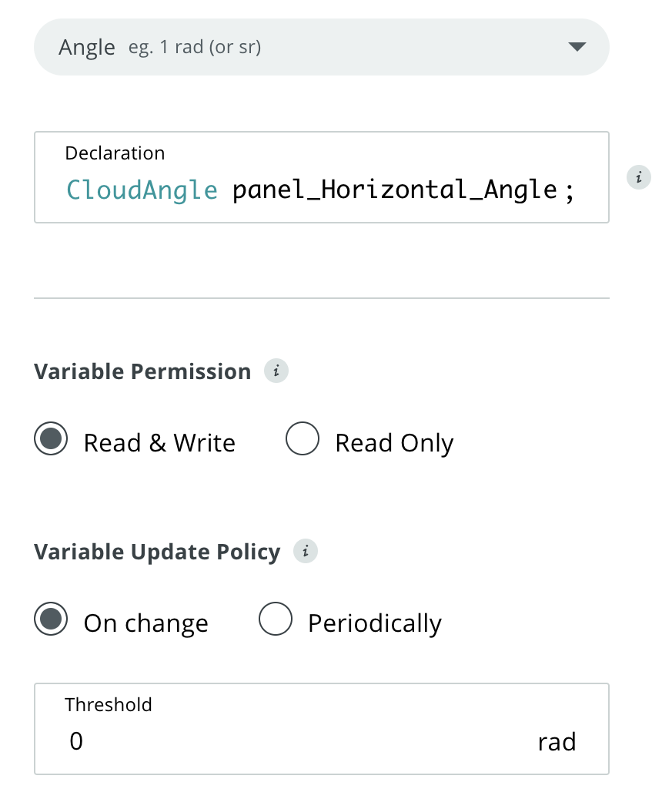
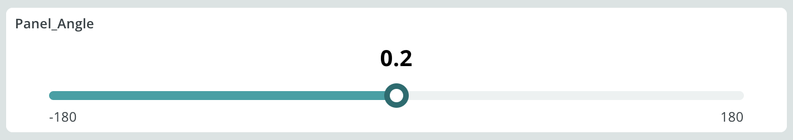

# Sunlight Meter V-2

接續 Sunlight Meter V1 的成果，這次要嘗試的功能是由 Arduino Cloud Dashboard 控製裝置上的元件。選擇的控制元件為步進馬達，搭配旋臂來調整太陽能板的水平角度。

## 系統元件

在原本 [Sunlight Meter V1 元件](../Sunlight_Meter_V1/README.md#%E7%B3%BB%E7%B5%B1%E5%85%83%E4%BB%B6)之外，添加兩個新元件

1. 28BYJ-48 步進馬達
2. ULN2003 驅動電路板

## 電路連接圖



## Arduino Cloud 設定

首先，在 Things 中新增變數 `Panel_Horizontal_Angle`，屬性要設為 Read & Write，這樣才能傳送變數值至裝置上。接著在儀表板新增 Slider，設定與 `Panel_Horizontal_Angle` 連動。





## 初始化陷阱（Pitfall）

先說結論，在 `ArduinoCloud.begin()` 執行後，要做一次步進馬達針腳設定，針腳模式設為輸出（OUTPUT)。`ArduinoCloud.begin()` 執行後會導致 GPIO25 無法輸出訊號，猜測 GPIO25 被變更為 INPUT 模式了。

```c++
const int IN1 = 27;  // Blue wire   - GPIO27
const int IN2 = 26;  // Pink wire   - GPIO26
const int IN3 = 25;  // Yellow wire - GPIO25
const int IN4 = 33;  // Orange wire - GPIO33
pinMode(IN1, OUTPUT);
pinMode(IN2, OUTPUT);
pinMode(IN3, OUTPUT);
pinMode(IN4, OUTPUT);
```


一開始 AI 產生的代碼看起來很完整，畢竟 ULN2003 和 28BYJ-48 是很常見的元件，AI 知道使用 28BYJ-48 時 IN2、IN3 要調換順序。

```
Stepper myStepper(STEPS_PER_REV, IN1, IN3, IN2, IN4);  // Note: IN3/IN2 swapped for correct sequence
```

程式上傳後，馬達可以逆時針轉動，但不論怎麼試，都無法順時針轉動，非常怪異。後來注意到 ULN2003 IN3 指示燈一直沒亮，所以請 AI 加上 `testPin()` 來測試 ULN2003 是否故障，結果發現 `ArduinoCloud.begin()` 執行之前，IN3 指示燈運作正常。

把結果回報給 AI，得到以下回覆，看回覆內容，AI 模型並不清楚 `ArduinoCloud.begin()`內部運作細節。

> Let's look at what happens before each testPin() call:
>
> 1. First testPin(): Right after setting pinMode - Works
> 2. Second testPin(): After INA219 initialization - Works
> 3. Third testPin(): After Stepper speed setting - Works
> 4. Fourth testPin(): After IoT Cloud connection - Doesn't work
>
> It seems the Arduino IoT Cloud initialization might be affecting GPIO25 (IN3, yellow wire).
>
> ...
>
> The key insight is that ESP32 pins can be reconfigured by different libraries or initialization processes. By explicitly setting the pin modes after each major initialization step (especially after IoT Cloud), we maintain the correct pin configuration for the stepper motor.
>
> Think of it like having multiple people using a shared workspace - you need to reset your workspace setup after someone else uses it. In this case, we're "resetting" our pin configurations after the IoT Cloud "uses" them.

## 主要程式邏輯

### onPanelHorizontalAngleChange()

Arduino Cloud 上的 `Panel_Horizontal_Angle` 數值變動時，會呼叫這個函式轉動步進馬達轉動。在`thingProperties.h`這段程式碼為數值變動事件註冊了處理函式

```
ArduinoCloud.addProperty(panel_Horizontal_Angle, READWRITE, ON_CHANGE, onPanelHorizontalAngleChange);
```

其中初始化 currentAngle 這段比較微妙。馬達當前角度 (currentAngle)在斷電後會消失，需要在重開機後恢復先前的數值。經過幾次測試，只要 `Panel_Horizontal_Angle` 不為零，重開機後 Arduino Cloud 會傳送一次數值到開發板，就可以用來初始化 currentAgle。

```
 // Handle initial angle sync from cloud
  if (currentAngle == INFINITY) {
    currentAngle = panel_Horizontal_Angle;
    Serial.print("Initial angle from cloud: ");
    Serial.println(currentAngle);
    return;
  }
```

### disableMotor()

在步達馬達轉動到所指示的角度後，關閉所有線路以節省電力。在輕度負荷情況下，這樣做不影響步進馬達維持角度的能力，但若在重度負荷的應用中，關閉電力會讓負荷的力量轉動馬達。

## 成品演示

演示影片：https://youtube.com/shorts/BH5Gpr3romA

## 實作心得

使用 dashboard widget 可以輕鬆實現遠端控制功能，且 widget 數值會儲存在 Arduino Cloud，開發板重啟後可以用網路取回數據。
