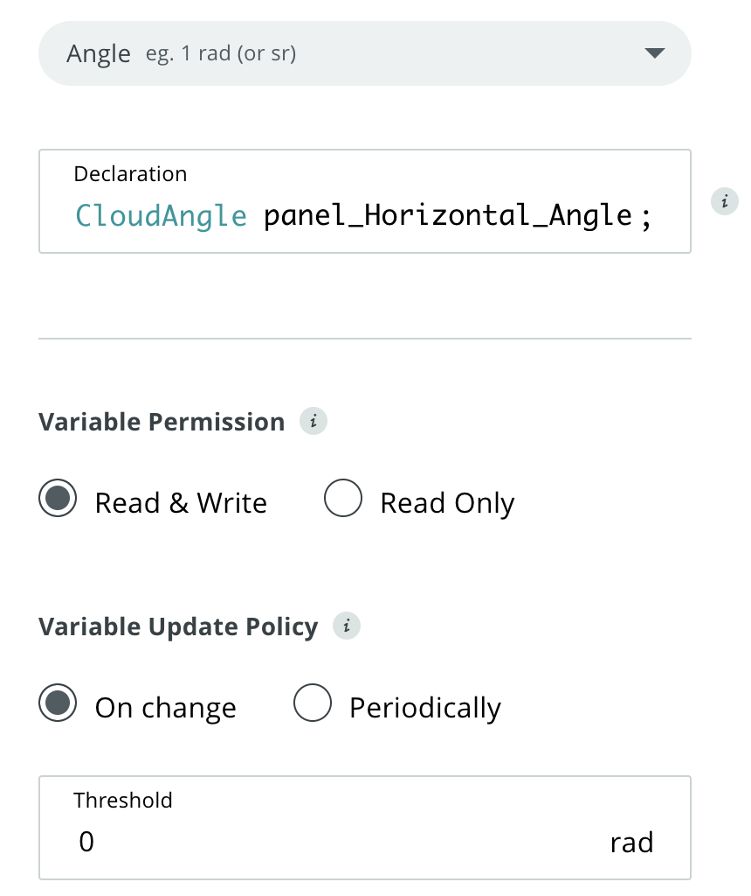

# Sunlight Meter V-2

（This content was translated from README.md using the Claude 3.5 Sonnet AI model）

Building upon the achievements of Sunlight Meter V1, this version aims to control device components through the Arduino Cloud Dashboard. The selected control component is a stepper motor, paired with an arm to adjust the solar panel's horizontal angle.

## System Components

In addition to the original [Sunlight Meter V1 components](../Sunlight_Meter_V1/README.md#system-components), two new components have been added:

1. 28BYJ-48 Stepper Motor
2. ULN2003 Driver Circuit Board

## Circuit Connection Diagram


## Arduino Cloud Setup

First, add a variable called `Panel_Horizontal_Angle` in Things, with its property set to Read & Write to enable sending variable values to the device. Then add a Slider in the dashboard, configured to link with `Panel_Horizontal_Angle`.




## Initialization Pitfall

To state the conclusion first: after executing `ArduinoCloud.begin()`, you need to configure the stepper motor pins again, setting the pin mode to OUTPUT. The execution of `ArduinoCloud.begin()` causes GPIO25 to stop outputting signals, presumably because GPIO25 is changed to INPUT mode.

```c++
const int IN1 = 27;  // Blue wire   - GPIO27
const int IN2 = 26;  // Pink wire   - GPIO26
const int IN3 = 25;  // Yellow wire - GPIO25
const int IN4 = 33;  // Orange wire - GPIO33
pinMode(IN1, OUTPUT);
pinMode(IN2, OUTPUT);
pinMode(IN3, OUTPUT);
pinMode(IN4, OUTPUT);
```

Initially, the AI-generated code looked complete, as ULN2003 and 28BYJ-48 are common components, and the AI knew to swap IN2 and IN3 when using the 28BYJ-48.

```
Stepper myStepper(STEPS_PER_REV, IN1, IN3, IN2, IN4);  // Note: IN3/IN2 swapped for correct sequence
```

After uploading the program, the motor could rotate counterclockwise, but oddly, it wouldn't rotate clockwise no matter what. Later, I noticed that the ULN2003 IN3 indicator light never lit up, so I asked the AI to add `testPin()` to test if the ULN2003 was faulty. The results showed that the IN3 indicator light worked normally before `ArduinoCloud.begin()` execution.

When reporting the results to the AI, the response indicated that the AI model wasn't clear about the internal workings of `ArduinoCloud.begin()`:

> Let's look at what happens before each testPin() call:
>
> 1. First testPin(): Right after setting pinMode - Works
> 2. Second testPin(): After INA219 initialization - Works
> 3. Third testPin(): After Stepper speed setting - Works
> 4. Fourth testPin(): After IoT Cloud connection - Doesn't work
>
> It seems the Arduino IoT Cloud initialization might be affecting GPIO25 (IN3, yellow wire).
>
> ...
>
> The key insight is that ESP32 pins can be reconfigured by different libraries or initialization processes. By explicitly setting the pin modes after each major initialization step (especially after IoT Cloud), we maintain the correct pin configuration for the stepper motor.
>
> Think of it like having multiple people using a shared workspace - you need to reset your workspace setup after someone else uses it. In this case, we're "resetting" our pin configurations after the IoT Cloud "uses" them.

## Main Program Logic

### onPanelHorizontalAngleChange()

This function is called when the `Panel_Horizontal_Angle` value changes on Arduino Cloud to rotate the stepper motor. In `thingProperties.h`, this code registers the handler function for value change events:

```
ArduinoCloud.addProperty(panel_Horizontal_Angle, READWRITE, ON_CHANGE, onPanelHorizontalAngleChange);
```

The initialization of currentAngle is particularly subtle. The motor's current angle (currentAngle) is lost after power loss and needs to be restored after restart. After several tests, as long as `Panel_Horizontal_Angle` is not zero, Arduino Cloud will send a value to the development board once after restart, which can be used to initialize currentAngle.

```
 // Handle initial angle sync from cloud
  if (currentAngle == INFINITY) {
    currentAngle = panel_Horizontal_Angle;
    Serial.print("Initial angle from cloud: ");
    Serial.println(currentAngle);
    return;
  }
```

### disableMotor()

After the stepper motor rotates to the indicated angle, all circuits are turned off to save power. Under light load conditions, this doesn't affect the stepper motor's ability to maintain its angle, but in heavy load applications, turning off power would allow the load force to rotate the motor.

## Product Demonstration

Demo video: https://youtube.com/shorts/BH5Gpr3romA

## Implementation Insights

Using dashboard widgets makes it easy to implement remote control functionality, and widget values are stored in Arduino Cloud, allowing data retrieval over the network after device restart.