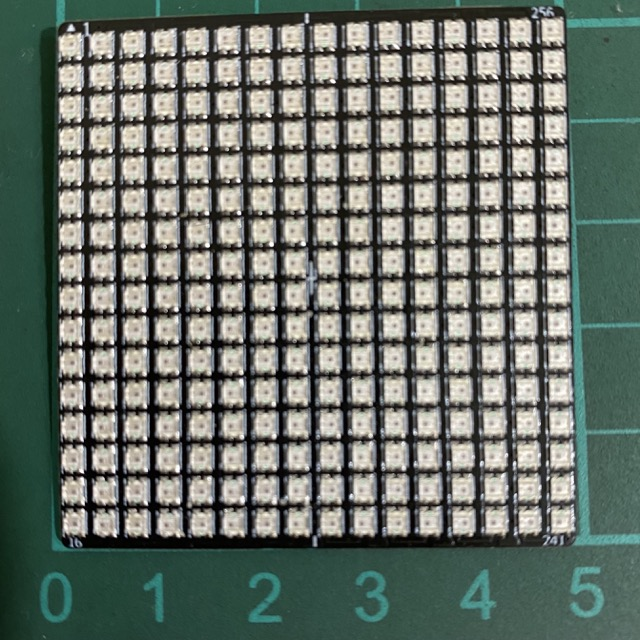

# WS2812B LED Checker

## 8x8 LED

這是一片 8x8 LED 矩陣，內建 WS2818B 驅動元件，總共只有三個接腳（VCC，GND，Data），就可以控制 64 顆彩色 LED，組裝起來很方便。

 

使用 AI(Claude 3.5 Sonnet) 輕易地寫出這個程式，讓 LED 燈依序點亮與關閉，演示影片：https://youtube.com/shorts/5dYDf9cxwh8?si=r4b1-NUnSdVwxMbZ。

## 16x16 2020 LED

這片面板的排列方式很特殊，自己手寫了 getUNShapeIndex() 來轉換 XY 座標為 LED index。用 Claude 3.7 Sonnet 寫功能說明，文字描述寫得不錯，但箭頭圖好像畫錯了。

```
 * Converts X,Y coordinates to LED index for a U/N-shaped serpentine pattern
 * For counterclockwise rotated 90 degrees S-shape panel.
 * 
 * In this pattern, even columns run bottom to top, odd columns run top to bottom:
 * 
 * 15,15 14,15 13,15 12,15 ... 1,15  0,15
 *   ↑     ↓     ↑     ↓         ↓     ↑
 * 15,0  14,0  13,0  12,0  ... 1,0   0,0
```




## 16x16 3030 LED

這片面板的排列方式又不一樣了，在偶數行(row)是從右邊亮到左邊，所以又手寫了 get2ShapeIndex() 來轉換座標，再用 Claude 3.7 Sonnet 把 int 改成 uint8_t，節省記憶體用量。


